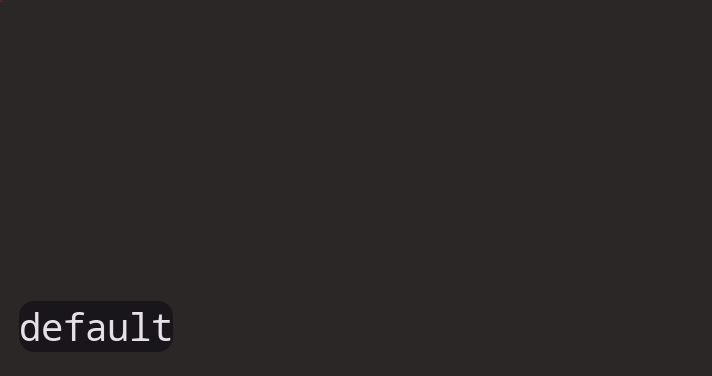

<h1 align="center">
  
  wshowkeys-mao-rounded
  
</h1>

<p align="center">
   <a href="#-changes-from-upstream">Changes</a> •
   <a href="#-features">Features</a> •
   <a href="#-installation">Installation</a> •
   <a href="#-usage">Usage</a> •
   <a href="#-options">Options</a> •
   <a href="#-build-from-source">Build</a>
</p>

A Wayland keystroke visualizer — [DreamMaoMao/wshowkeys](https://github.com/DreamMaoMao/wshowkeys) fork with **rounded corners** and **centered text** support.

Displays key presses on screen for screencasts, presentations, or live coding. Works on any Wayland compositor with `wlr_layer_shell_v1` support (Sway, Hyprland, Niri, KDE, etc.).

## ✨ Changes from Upstream

This fork adds the following to `main.c` against the upstream [DreamMaoMao/wshowkeys](https://github.com/DreamMaoMao/wshowkeys):

| Change | Details |
| ------ | ------- |
| **Rounded corners** (`-r`) | `rounded_rect()` helper draws a rounded-rect path using `cairo_arc()`. Applied as a clip region on both mods and keys surfaces before painting. Stores `corner_radius` in state struct. |
| **Fixed width + centering** (`-w`) | When set, forces keys surface to a fixed pixel width and centers text horizontally instead of left-aligning. |
| **Length limit** (`-l`) | Drops oldest keys when text exceeds the character limit. |

All additions are behind new flags (`-r`, `-w`) and default to `0` (disabled) — fully backward-compatible.

## ✨ Features

- Rounded corners (`-r <radius>`)
- Fixed-width mode with centered text (`-w <pixels>`)
- Length limit — drops oldest keys when too long (`-l <chars>`)
- Color customization — background, foreground, special keys
- Modifier key indicators, mouse button display, scroll wheel display
- Setuid sandbox — drops root privileges after device setup
- Auto-colored via Matugen on wallpaper change

## 📸 Gallery

| Text input                              |
| --------------------------------------- |
|      |

| Modifier keys                           |
| --------------------------------------- |
|  |

| Repeated keys                           |
| --------------------------------------- |
|  |

## 📦 Installation

### From AUR (once uploaded)

```bash
paru -S wshowkeys-mao-rounded
```

### Manual (PKGBUILD)

```bash
git clone https://github.com/bt-ASH/wshowkeys-mao-rounded.git
cd wshowkeys-mao-rounded
makepkg -si
```

## 🚀 Usage

```bash
wshowkeys -a bottom -a right -m 20 -l 24 -r 15 \
  -b '#00000099' -f '#FFFFFFFF' -s '#FF8800FF' \
  -F 'monospace 28'
```

### Niri keybind (toggle on/off)

```kdl
Mod+Alt+K spawn "~/.config/niri/scripts/wshowkeys-toggle.sh"
```

### Auto-color with Matugen

When you change wallpaper via waypaper, Matugen regenerates colors and restarts wshowkeys automatically.

## ⚙️ Options

| Flag | Description | Default |
| ---- | ----------- | ------- |
| `-b` | Background color `#RRGGBB[AA]` | `#000000cc` |
| `-f` | Foreground (key text) color | `#ffffffff` |
| `-s` | Special keys color | `#aaaaaaff` |
| `-F` | Font (Pango format) | `Sans Bold 40` |
| `-t` | Timeout before clearing (ms) | `200` |
| `-r` | Corner radius (px) | `0` |
| `-w` | Fixed width for centered text (px) | `0` (auto) |
| `-l` | Length limit (character units) | `100` |
| `-a` | Anchor: `top` `bottom` `left` `right` | — |
| `-m` | Margin from edge (px) | `32` |
| `-M` | Show modifier key indicator | off |
| `-U` | Show mouse buttons | off |
| `-S` | Show scroll wheel | off |

## 🔧 Build from Source

```bash
git clone https://github.com/bt-ASH/wshowkeys-mao-rounded.git
cd wshowkeys-mao-rounded
makepkg -si
```

Dependencies: `cairo`, `pango`, `libinput`, `libxkbcommon`, `wayland`, `meson`, `wayland-protocols`

## 📄 License

GPL — same as upstream.

Forked from [DreamMaoMao/wshowkeys](https://github.com/DreamMaoMao/wshowkeys), originally from [ammgws/wshowkeys](https://github.com/ammgws/wshowkeys) & [~sircmpwn/wshowkeys](https://git.sr.ht/~sircmpwn/wshowkeys).
